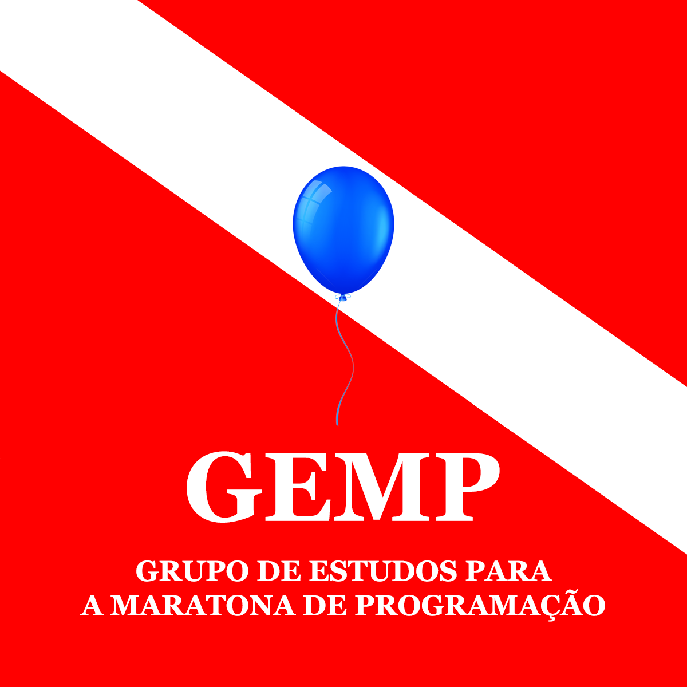

  

# GEMP UFPA
Grupo de estudos para programação competitiva, visando principalmente a [OBI](https://olimpiada.ic.unicamp.br/) e a [Maratona de Programação](http://maratona.sbc.org.br/). Nosso objetivo é desenvolver a cultura, e criar uma comunidade, de Programação Competitiva na UFPA.

## Membros
- Carlos Dias;
- Carlos Serrato (Egresso)
- Diego Dantas;
- Felipe Cardoso;
- Flavio Mendes (Egresso)
- Jeremias Abreu;
- Lucas Queiroz (Egresso);
