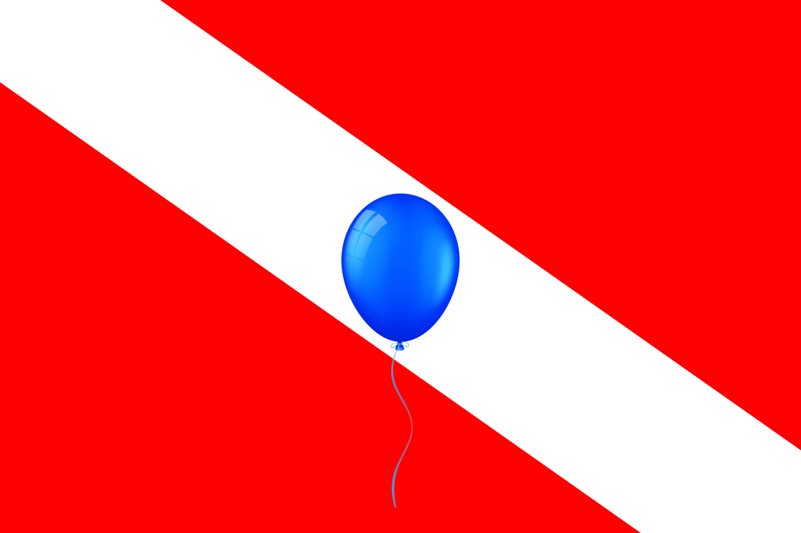

  
  <h1 align="center">GEMP-UFPA</h1>

Grupo de estudos para programação competitiva, visando principalmente a [OBI](https://olimpiada.ic.unicamp.br/) e a [Maratona de Programação](http://maratona.sbc.org.br/). Nosso objetivo é desenvolver a cultura, e criar uma comunidade, de Programação Competitiva na UFPA.

## Apresentação

**Nossos objetivos** como grupo são desenvolver a cultura de Programação Competitiva na UFPA e criar uma comunidade na mesma. Além de ser bastante divertido resolver problemas, participar dessas competições acadêmicas nos motiva a continuar aprendendo e desenvolvendo habilidades que serão importantes se quisermos ser bons profissionais, e também, traz mais visibilidade tanto para a UFPA quanto para o Pará no cenário nacional em computação. Porém, há certas limitações para o que indivíduos isolados podem fazer, principalmente quando estes não tem o ambiente ideal para se dedicar somente aos estudos.

Levando em consideração a desigualdade que as pessoas enfrentam, para que todos tenham oportunidades, queremos desenvolver a cultura não só em questão de performance em competições ou em números de participação, mas também que nossos membros não deixem seu tempo de lazer de lado, nem que sacrifiquem outros aspectos da sua vida para se dedicar ao treino.

### Como estamos tentando atingir esses objetivos?
Algumas coisas que estamos fazendo atualmente são:
- Apresentar anualmente o GEMP e o "mundo" de programação competitiva na semana dos calouros da UFPA.
- Treinar para continuar melhorando nossas participações em finais brasileiras da Maratona de Programação.
- Ensinar os tópicos de computação para novos alunos por meio de encontros semanais e discussões em grupo.
- Tentar firmar parcerias com a faculdade de computação ou laboratórios da universidade.

Além disso, incentivamos um **ritmo saudável de estudo**, além de dar suporte levando em conta as especificidades de cada pessoa. 

Em relação aos estudos, **nosso foco é menos na quantidade e mais na qualidade desse treino**. Acreditamos que praticar de forma **consistente** e com os **melhores materiais disponíveis** vale mais do que horas a fio pelas madrugadas. E por isso os membros do GEMP também tem a preocupação de fazer **curadoria** sobre as principais referências de estudo em programação competitiva.

### Nossos valores
Para construir uma *boa* comunidade em volta desta cultura, não bastam apenas números. Estamos sempre tentando nos desenvolver mais como pessoas de forma que isso também tenha um impacto real na interação com nossos colegas e no processo de aprendizagem coletivo. Efetivamente estamos sempre trabalhando:

- **Responsabilidade**. Quando vamos explicar ou ensinar alguma coisa sempre tomamos a responsabilidade, dado que se a outra pessoa não entende completamente a explicação, o problema não é dela por não entender, e sim nossa por não explicar da melhor forma.

- **Respeito**. Somos contra qualquer tipo de discriminação, e mais ainda, somos contra qualquer tipo de atitude com objetivo de inferiorizar o outro, então nenhuma pergunta é "idiota" e respeitamos o ritmo de aprendizado de cada pessoa.

- **Humildade**. Ninguém é perfeito, e estamos sempre melhorando, então estamos sempre abertos a críticas construtivas.

### Sobre o processo de aprendizagem

A primeira coisa que estaremos desenvolvendo é a nossa **autonomia** no processo de aprendizagem. Isso **não significa fazer tudo sozinho**, e sim que estaremos ativamente sempre indo atrás daquilo que queremos aprender, pesquisando documentação, pedindo recomendação de boas referências, e, claro, pedindo ajuda quando necessário.

Richard Feynman disse que **"Se você quer dominar algo, ensine"** e, bem, nós levamos isso no coração. Encaramos as oportunidades de ensinar algo para os novos membros como formas de solidificar os conhecimentos que adquirimos até então, pois não basta que faça sentido apenas para nós, mas que consigamos explicar de forma que faça sentido para o outro também.

Nossos estudos são **orientados a resolução de problemas**, ou seja, não basta apenas saber a teoria, estamos o tempo inteiro praticando os novos conhecimentos ao resolver problemas em Online Judges, e muitas vezes também estaremos estudando novos tópicos por necessidade, para resolver problemas que não conseguíamos antes.

Estamos o tempo inteiro discutindo tópicos com o grupo para **acelerar nosso aprendizado e compartilhar experiência**. Se lemos uma referência, damos nossa opinião sobre a leitura. Também comparamos ideias e implementações para **aprender mais de 100%** com cada problema resolvido.

## Membros
Membros Coordenadores são os membros que estão planejando e executando novas atividades do grupo.

Membros Egressos são os membros que já passaram pelo grupo, mas que já não estão tão ativos.

**Membros Coordenadores:**

- Carlos Dias
- Diego Dantas
- Felipe Cardoso
- Jeremias Abreu

**Membros Egressos:**

- Carlos Serrato
- Flavio Mendes
- Lucas Queiroz