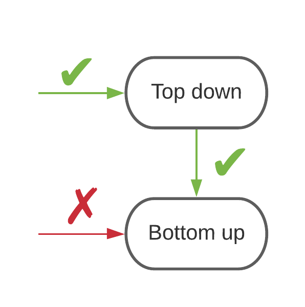
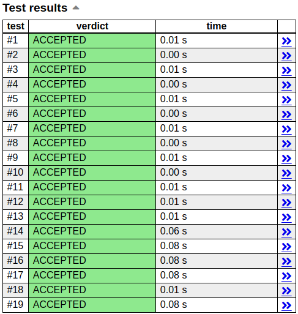

> Autor: Felipe Cardoso

# Conversão de DP Top-down para Bottom-up

Durante o treino no tópico de Programação Dinâmica, com o aumento do nível de dificuldade dos problemas vemos uma tendência de soluções com DP projetadas *bottom-up* ganhando mais relevância, seja por ser amigável a otimizações, ou por ter *constantes* menores. 
Porém, para maratonistas inexperientes projetar uma DP bottom-up pode não ser uma tarefa fácil ~~e as vezes nada intuitiva~~, e tendem a se agarrar à implementação top-down, o que pode desacelerar seu ritmo de aprendizado.

Embora pensar direto numa implementação bottom-up possa ser um pouco difícil de primeira, converter uma DP top-down para bottom-up é fácil.
Então temos a seguinte estratégia para implementar DP bottom-up: Começar implementando top-down, e depois converter de top-down para bottom-up.

<p align="center">
  
</p>

O objetivo deste texto é, então, apresentar um passo a passo para o leitor que ainda não se sente tão confortável em projetar Programação Dinâmica bottom-up diretamente, para que continuem desenvolvendo suas habilidades enquanto aperfeiçoam seu entendimento ao resolver mais problemas e ao discutir com a comunidade.

## Tabela de Conteúdos

- [Passo 0: Fazer uma DP top-down](#passo-0-fazer-uma-dp-top-down)
- [Passo 1: Construir casos base](#passo-1-construir-casos-base)
- [Passo 2: Definir ordem de iteração dos laços](#passo-2-definir-ordem-de-iteração-dos-laços)
- [Passo 3: Copiar as transições da top-down](#passo-3-copiar-as-transições-da-top-down)
- [Passo 4: Trocar chamadas recursivas por acessos à tabela](#passo-4-trocar-chamadas-recursivas-por-acessos-à-tabela)
- [Passo 5: Guardar a resposta calculada](#passo-5-guardar-a-resposta-calculada)
- [Resumo e Conclusão](#resumo-e-conclusão)

## [Passo 0: Fazer uma DP top-down](#tabela-de-conteúdos)

Bem, se você quer converter sua solução de top-down para bottom-up, você precisa já ter uma solução para o problema que está tentando resolver. 
Se você não sabe como fazer uma solução top-down ainda, pode dar uma olhada na referência [1] do nosso [RoadMap](./README.md) de programação dinâmica ou pedir mais orientações para a comunidade. 
A partir daqui assumiremos que o leitor conhece os conceitos de programação dinâmica.

Para que este passo a passo faça mais sentido, iremos trabalhar um exemplo ao longo da discussão. Iremos resolver o problema [Dice Combinatinons](https://cses.fi/problemset/task/1633) do online judge [CSES](https://cses.fi/problemset/).

O enunciado do problema pede para acharmos de quantas formas podemos fazer uma soma *n* jogando dados, que tem faces numeradas de 1 a 6.

Ao pedir "**de quantas formas** podemos fazer uma soma" podemos identificar uma natureza combinatória neste problema, visto que queremos *contar* esses jeitos de fazer a soma. 
Então para resolvê-lo vamos usar **análise combinatória**. 

Para cada lançamento do dado você pode obter resultados de 1 a 6, e como cada possibilidade representa uma *forma distinta* (ou um *evento disjunto* em combinatória) de fazer a soma *n*, pelo **princípio da adição** [[1]](./dp-conversao.md#referências), a resposta de *quantas formas* há de fazer soma *n* é a soma de:

- (Todas as formas de fazer a soma n-1) * (a única forma de tirar 1 em um lançamento) = (todas as formas de fazer a soma n a partir de n-1).
- (Todas as formas de fazer a soma n-2) * (a única forma de tirar 2 em um lançamento) = (todas as formas de fazer a soma n a partir de n-2).
- (Todas as formas de fazer a soma n-3) * (a única forma de tirar 3 em um lançamento) = (todas as formas de fazer a soma n a partir de n-3).
- (Todas as formas de fazer a soma n-4) * (a única forma de tirar 4 em um lançamento) = (todas as formas de fazer a soma n a partir de n-4).
- (Todas as formas de fazer a soma n-5) * (a única forma de tirar 5 em um lançamento) = (todas as formas de fazer a soma n a partir de n-5).
- (Todas as formas de fazer a soma n-6) * (a única forma de tirar 6 em um lançamento) = (todas as formas de fazer a soma n a partir de n-6).

> Com apenas um lançamento só tem uma forma de tirar 1, uma forma de tirar 2, uma forma de tirar 3, e assim por diante. 
Então o lado esquerdo das equações acima representa o **princípio da multiplicação** [[1]](./dp-conversao.md#referências), e por só ter uma forma de tirar um número de 1 a 6, demos uma ênfase em "a **única** forma [...]".

Dessa forma vemos uma relação entre a resposta de quantas formas há de fazer soma *n* a partir de quantas formas há de fazer somas *n-1*, *n-2*, *n-3*, *n-4*, *n-5* e *n-6*. 
Mais especificamente, se criarmos uma função f(n) que significa "de quantas formas podemos obter soma n lançando dados de 6 faces", temos a seguinte relação *recursiva*:

```
f(n) = f(n-1) + f(n-2) + f(n-3) + f(n-4) + f(n-5) + f(n-6)
```

> Esse é um bom momento para observar que o problema que queremos resolver tem a propriedade de **subestrutura ótima**, dado que a resposta para o nosso problema depende da resposta de subproblemas mais simples.

Para completar nossa solução, precisamos agora definir os casos base dessa recursão. 
Casos base são aqueles subproblemas que são tão triviais que a resposta é quase óbvia, e você nem precisa pensar muito para responder ~~na maioria das vezes~~. 
No nosso problema são:

- Se n = 0, então f(n) = 1, pois só tem uma forma de fazer soma 0, que é **não fazer nada**. Se você quer fazer uma soma 0, então você não vai fazer nenhum lançamento, pois já tem a soma desejada, e essa **é uma forma válida de contar em combinatória**.

- Se n < 0, então f(n) = 0, pois não tem como você fazer uma soma negativa, dado que fazendo zero ou mais lançamentos a soma de faces obtida é sempre não negativa.

Agora podemos implementar uma função que resolve nosso problema. 

```cpp
const int MOD = 1e9 + 7;
int f(int n) {
  if (n == 0) {
    return 1;
  }
  if (n < 0) {
    return 0;
  }

  int ans = 0;
  for (int i = 1; i <= 6; ++i) {
    ans += f(n-i);
    ans %= MOD;
  }
  return ans;
}
```

Embora esta solução esteja correta, ela é muito **lenta**. De fato, a classe de complexidade temporal dessa solução é exponencial, em notação *Big-O* ela é **O(6^n)**. 
Mas, como sabemos, a lentidão dessa solução ocorre do fato de que um estado é recalculado várias e várias vezes, devido à **sobreposição de subproblemas**. Então, para melhorar nossa solução basta aplicar **memoization**:

```cpp
const int MOD = 1e9 + 7;
const int MAXN = 1e6 + 7;
int dp[MAXN];
bool seen[MAXN];

int f(int n) {
  if (n == 0) {
    return 1;
  }
  if (n < 0) {
    return 0;
  }

  //Se esse estado já foi calculado, retorne a resposta
  if (seen[n]) return dp[n];

  int ans = 0;
  for (int i = 1; i <= 6; ++i) {
    ans += f(n-i);
    ans %= MOD;
  }

  //marque o estado como calculado e guarde a resposta
  seen[n] = true;
  return dp[n] = ans;
}
```
E aí está! Com essas duas linhas de código agora a complexidade temporal do nosso algoritmo é **O(n)**, linear!!
Sempre que calculamos alguma coisa guardamos essa informação em um tabela, e quando chegamos novamente em um estado previamente calculado, em vez de calcular tudo de novo só usamos a resposta guardada na tabela.
Dessa forma garantimos que cada estado só é calculado uma vez, e que o esforço computacional pra calcular a resposta de um estado é **O(1)** (as seis iterações do laço de repetição).

Com essa DP já conseguiremos um *Accepted* no problema. 
Ao submeter o [código](https://cses.fi/paste/db6be769a1459c102a2193/), vemos que nosso programa passou nos casos de teste, e com tempo máximo de 80 milissegundos:

<p align="center">
  
</p>

Agora que temos uma solução top-down para o nosso problema, podemos começar a conversão para bottom-up!

## [Passo 1: Construir casos base](#tabela-de-conteúdos)

Diferentemente de uma DP top-down, onde a tabela tem um papel auxiliar apenas para guardar e olhar valores, numa DP bottom-up a tabela tem um papel central, visto que estaremos computando a resposta para cada subproblema acessando os estados previamente calculados diretamente na tabela.

Como as dimensões da tabela representam os subproblemas, a tabela da bottom-up vai ter a mesma dimensão da tabela utilizada na top-down (pois lá você também tinha tantas dimensões quanto parâmetros para poder guardar a resposta para um subproblema).
Nesse problema que estamos trabalhando a tabela será de uma dimensão, que abrange todos os valores possíveis da variável soma desejada, ou seja, de 0 a 1000000.

```cpp
const int MAXN = 1e6 + 7; //com um pouco de folga
int dp[MAXN];
```

A primeira coisa a se fazer numa DP bottom-up é inicializar a tabela da DP com os casos base, ou seja, subproblemas tão triviais que a resposta é quase óbvia.
Bem, **os casos base da bottom-up são os mesmos da top-down**! Se n = 0, então a resposta é 1, se n < 0 a resposta é 0:

```cpp
const int MOD = 1e9 + 7; //necessário para o problema
const int MAXN = 1e6 + 7; 
int dp[MAXN];

void solve(int N) { //N é a soma desejada
  dp[0] = 1; //soma = 0, resposta é 1. Inicializada direto na tabela 
  //soma < 0 será tratada durante as transições
}
```

Note que os casos para n < 0 não vão ser inicializados na tabela, por dois motivos:
- Matrizes em C++ não tem índices negativos;
- Existem infinitos números negativos, o que não tornaria viável inicializar a tabela para este caso, mesmo que houvessem índices negativos. 
Para contornar essa situação, e explorando o fato de que nesses casos a resposta é 0, ou seja, não vai adicionar nada de novo à resposta do subproblema, podemos simplesmente impedir que o programa acesse índices negativos.
Esse tratamento é feito durante as transições, no passo 3.

## [Passo 2: Definir ordem de iteração dos laços](#tabela-de-conteúdos)

Na bottom-up estaremos percorrendo a tabela com laços de repetição, e como tem uma relação de dependência entre os subproblemas, alguns tem que ser calculados antes de outros, devemos escolher uma ordem (do menor para o maior ou do maior para o menor) para que as respostas sejam calculadas corretamente.

Para definir esta ordem, **basta olharmos para as transições** da top-down.
Para calcular a resposta pro estado *n*, precisamos que as respostas pros estados *n-1*, *n-2*, ..., *n-6* já tenham sido calculadas, ou seja, precisamos que somas *menores* já tenham sido calculadas. Isso nos diz que devemos computar as respostas da menor soma para a maior! Logo:

```cpp
const int MOD = 1e9 + 7;
const int MAXN = 1e6 + 7;
int dp[MAXN];

void solve(int N) {
  dp[0] = 1;
  for (int n = 1; n <= N; ++n) { //itera da menor soma para a maior

  }
}
```

## [Passo 3: Copiar as transições da top-down](#tabela-de-conteúdos)

Sim, literalmente isso! As transições da bottom-up são as mesmas da top-down, com um pequeno detalhe de que não podemos acessar índices negativos, mas isso é fácil de tratar. Assim, pegando as transições da top-down ficamos com:

```cpp
const int MOD = 1e9 + 7;
const int MAXN = 1e6 + 7;
int dp[MAXN];

void solve(int N) {
  dp[0] = 1;
  for (int n = 1; n <= N; ++n) {
    //mesmas transições da top-down
    int ans = 0;
    for (int i = 1; i <= 6 && n-i >= 0; ++i) { //evita acesso a índices negativos
      ans += f(n-i);
      ans %= MOD;
    }
  }
}
```

## [Passo 4: Trocar chamadas recursivas por acessos à tabela](#tabela-de-conteúdos)

Como podemos ver, tem uma chamada para nossa função *f* no meio do código. Neste passo iremos apenas trocar qualquer chamada à função por acessos diretos à tabela:

```cpp
const int MOD = 1e9 + 7;
const int MAXN = 1e6 + 7;
int dp[MAXN];

void solve(int N) {
  dp[0] = 1;
  for (int n = 1; n <= N; ++n) {
    int ans = 0;
    for (int i = 1; i <= 6 && n-i >= 0; ++i) {
      ans += dp[n-i]; //troca chamada recursiva por acesso à tabela
      ans %= MOD;
    }
  }
}
```

## [Passo 5: Guardar a resposta calculada](#tabela-de-conteúdos)

Se você já calculou a resposta para um subproblema, a única coisa que falta é guardar essa resposta na tabela:

```cpp
const int MOD = 1e9 + 7;
const int MAXN = 1e6 + 7;
int dp[MAXN];

void solve(int N) {
  dp[0] = 1;
  for (int n = 1; n <= N; ++n) {
    int ans = 0;
    for (int i = 1; i <= 6 && n-i >= 0; ++i) {
      ans += dp[n-i];
      ans %= MOD;
    }

    dp[n] = ans; //salva a resposta
  }
}
```

E aí está! Sua solução na forma bottom-up bonitinha! Ao submeter o [código](https://cses.fi/paste/8f78936ba784b0152a3100/) temos o seguinte resultado:

<p align="center">
  
</p>

Nos casos de teste mais computacionalmente intensivos tivemos uma melhora de 50% no nosso tempo de execução, caindo para 40 milissegundos!

## [Resumo e Conclusão](#tabela-de-conteúdos)

Recapitulando o que fizemos, podemos resumir os passos para conversão em:

- Passo 1: Construir casos base (**são os mesmos casos base da recursão**)
- Passo 2: Definir ordem de iteração dos laços (**basta olhar para as transições**, se a recursão vai do maior para o menor subproblema, os laços tem que iterar do menor para o maior subproblema, e vice-versa)
- Passo 3: Copiar as transições da top-down para a bottom-up (literalmente)
- Passo 4: Trocar chamadas recursivas por acesso direto à tabela.
- Passo 5: Guardar a resposta calculada (como é feito na top-down)

E com a versão bottom-up da DP você pode tentar atingir novos patamares, como aplicar otimizações de DP ou implementar o algoritmo levando em consideração aspectos arquiteturais da máquina para aumentar a performance do seu programa! 
Inclusive, no problema que foi trabalhado é possível otimizar as transições dessa DP bottom-up para calcular a resposta pra um subproblema com apenas uma operação em vez de seis, fica o desafio para o leitor praticar seus conhecimentos! 

## Referências

[1] [Princípios Aditivo e Multiplicativo da Análise Combinatória](http://matematica-na-veia.blogspot.com/2009/07/analise-combinatoria-principio-aditivo.html)
